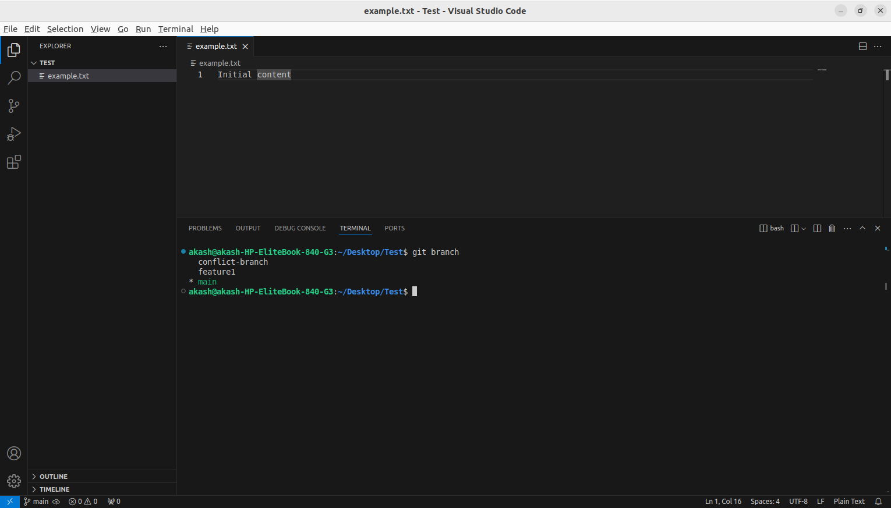
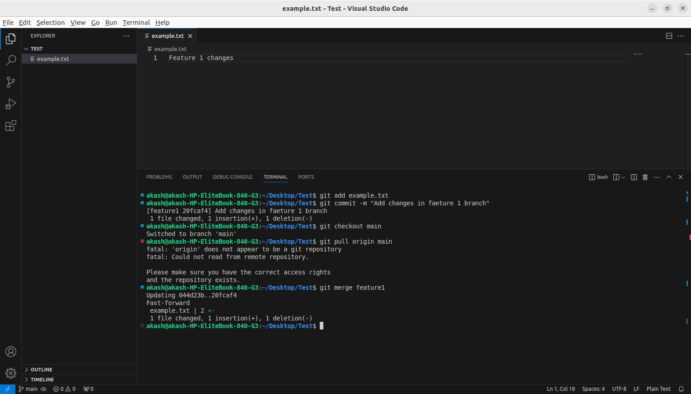
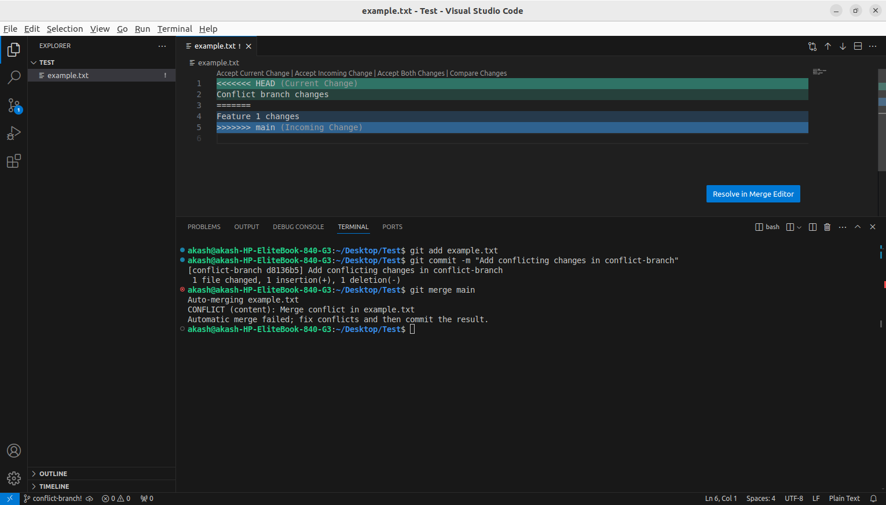
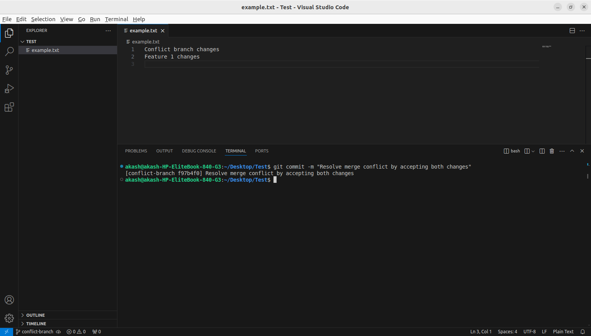
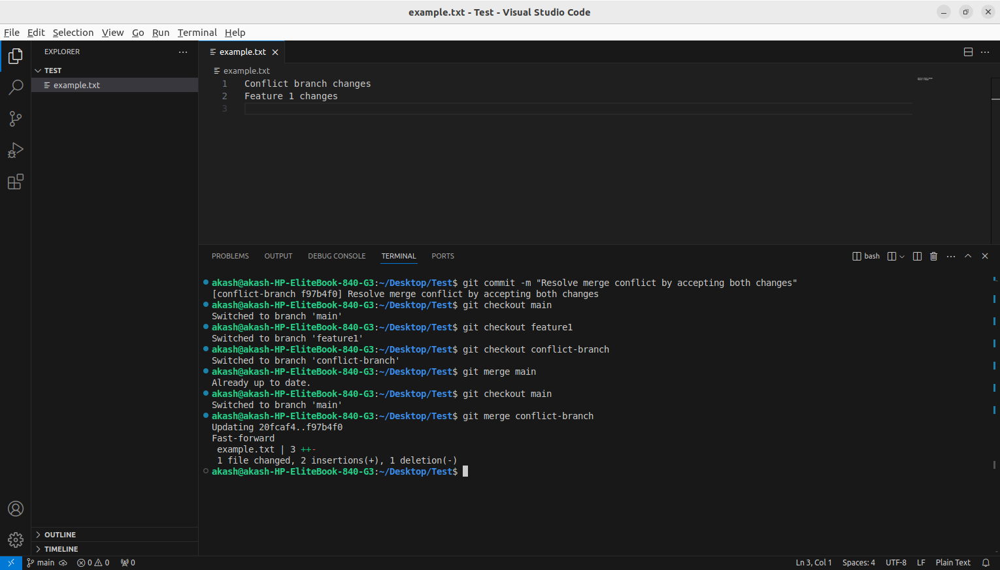
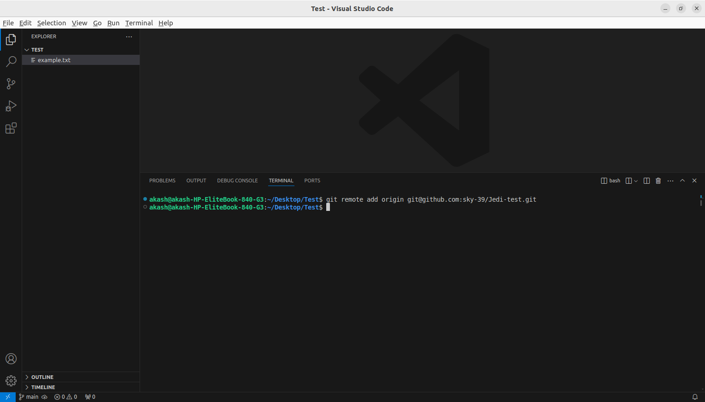
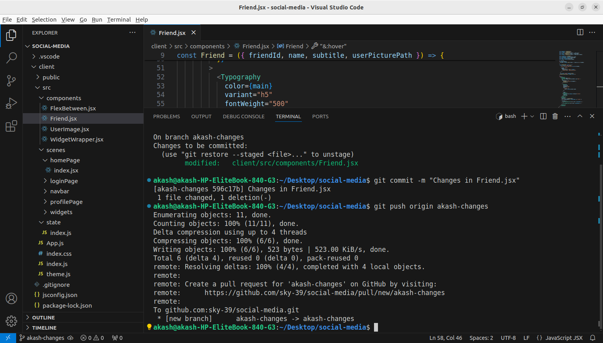
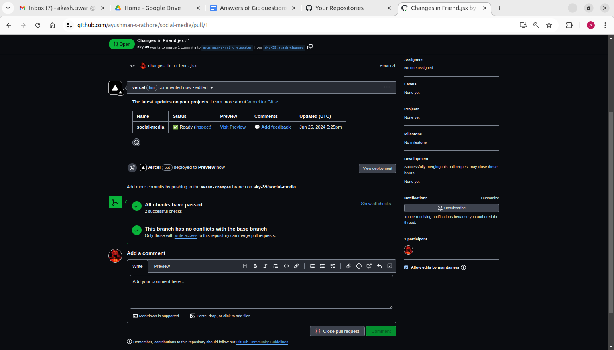
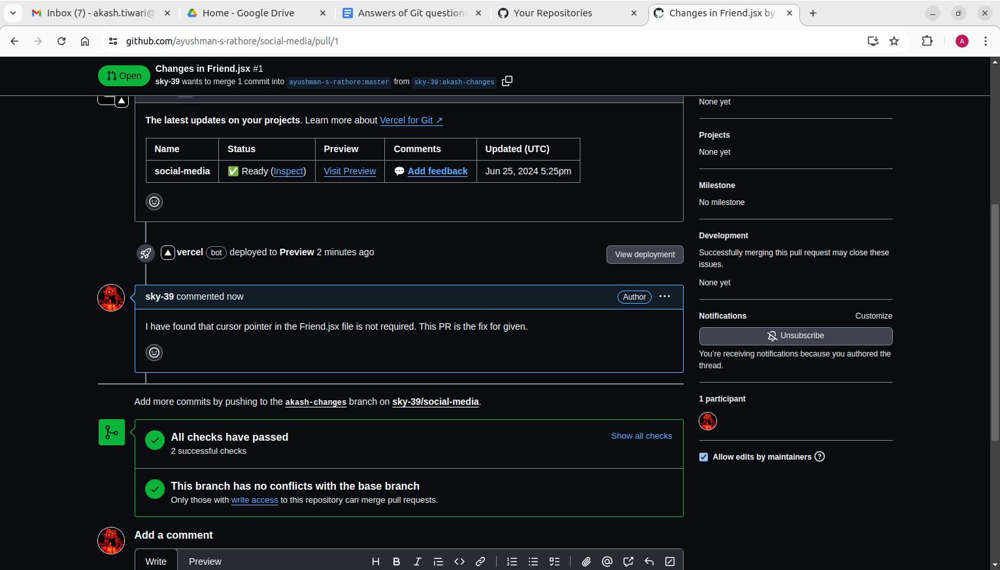

## Set your username and email in git config
```bash
   git config –global user.name sky-39
   git config –global user.email akash.tiwari@practo.com
   ```
## Create a new branch named "feature-branch" and switch to it.
```bash
 git checkout -b feature-branch
 ```
## List all branches in the repository.
```bash
  git branch
  ```
## Delete the branch “feature-branch”
  ```bash
    git branch -d feature-branch
  ```
## How do you undo the last commit

```bash 
    git revert head
```
## Create a new branch names “conflict-branch”
```bash
git checkout -b conflict-branch
```
## Create a another branch named “feature1”
```bash
git checkout -b feature1
```
## Make some changes in to feature1 branch
  

## Merge “feature1” branch into main branch
```bash
 git checkout main
 git merge feature1
 ```
 
## Make changes in “conflict-branch”, in the same file and line that you had made changes in feature1
Made changes in example.txt
## Merge master into conflict-branch [Attach screenshot of terminal & file]


## Resolve merge conflicts
Make some necessary changes in file 


## Add a remote named "origin" pointing to a GitHub repository.
```bash
git remote add origin git@github.com:sky-39/Jedi-test.git
```

## Fork a repository on GitHub and clone it to your local machine.
```bash 
git clone git@github.com:sky-39/social-media.git
```
## Create a new branch on your fork, make changes, and open a pull request to the original repository.


## Comment on a PR and suggest improvements

## Create a Git alias for the command `git log --oneline` named `gitlol`.
```bash
git config --global alias.gitlol "log --oneline"
```
## Create a pre-commit hook
## You have made local changes in your branch, but you need to switch to another branch urgently without committing. How would you handle this situation?
```bash
git stash
git checkout branch1
# when come to this same branch again
git checkout branch2
git stash apply
```
## You accidentally deleted a file in your local repository. How do you restore it using Git?
```bash
git restore <filename>
```
## You have committed changes to your branch but forgot to include a file. How do you add the file to the last commit without creating a new commit?
```bash
 git add file_name
 git commit --amend --no-edit
 ```
## You want to discard all changes in your working directory and revert to the last commit. What Git command would you use?
```bash 
 git reset --hard head
 ```
## You need to view a specific commit's changes. What Git command can be used to show the changes introduced by a particular commit?
```bash
git show <commit-hash>
```
## You want to change a commit message, after you have already committed, how do you do so?
```bash
git commit --amend
```
## Your colleague has made changes in their branch, and you want to incorporate those changes into your branch without merging. How do you achieve this?
```bash
  git checkout <my_branch>
  git cherry-pick <commit-hash>
```
## You've made several commits on a branch, but you want to club them into a single commit before pushing to the remote repository. How would you do that?
```bash
 git rebase -i master
 ```
## You accidentally staged a file that you don't want to commit. How do you unstage it?
```bash
git reser head <path to file>
```
## You don’t want to commit files that have .yml in the end, and also files inside folder config. How do you do that?
```bash
*.yml
config/
```
Add these two lines in .gitignore file and we're good to go.
## You want to see a list of all the files changed in the last commit. What Git command would you use?
```bash
git log -p -1
```

## You realize that your local branch is outdated, and you want to fetch the latest changes from the remote repository. How do you do this without merging?
```bash
git fetch origin
git rebase origin/main
```
## You accidentally deleted a branch. How do you recover it?
```bash 
git checkout -b <branch-name> <commit-hash>
```
## You want to remove untracked files and directories from your working directory. What Git command would you use?
```bash
git clean -f -d
```
## You have a commit from a feature branch that you want to apply to the main branch without merging the entire feature branch.
```bash
git checkout main
git cherry-pick <commit-hash>
```

## You mistakenly committed a change to the wrong branch and need to apply that commit to the correct branch.
```bash
git checkout corrected-branch
git cherry-pick <commit-hash>
```
## There is a series of commits on a feature branch, but you only want to cherry-pick a specific range of commits. 
```bash
git cherry-pick <commit-hash-1>..<commit-hash-last>
```
## You want to clone a GitHub repository onto your local machine, but you only need a specific branch. How can you achieve this?
```bash
git clone -b <branch-name> <repo-link>
```
## You've made changes to your local repository and want to push them to your fork on GitHub. What Git commands would you use?
```bash
git push origin <my-branch-name>
```
## You want to create a new branch both locally and on GitHub to work on a new feature. What commands would you use?
```bash
git checkout -b <branch-name>
git push origin <branch-name>
```
## You want to see the commit history of a GitHub repository. How can you do this using Git commands?
```bash
git log
```
## You've accidentally committed sensitive information and want to remove the commit from both your local and remote repositories on GitHub. What commands would you use?
```bash
git reset --hard <commit-id till want to delete>
git push --force
```

## You want to delete a remote branch on GitHub. What Git command would you use?
```bash
git push origin -d <branch-name>
```
## Create a git repository for all your assignments and upload them in it. Ask your peers to code review it, and you need to code review your peers assignments

## Create a pull request on any open source library on github, attach the pull request link to the readme file of this project’s repository

https://github.com/sky-39/node/pull/new/first-open-source-akash


## Link to the test project used for the assignment
https://github.com/sky-39/Jedi-test.git